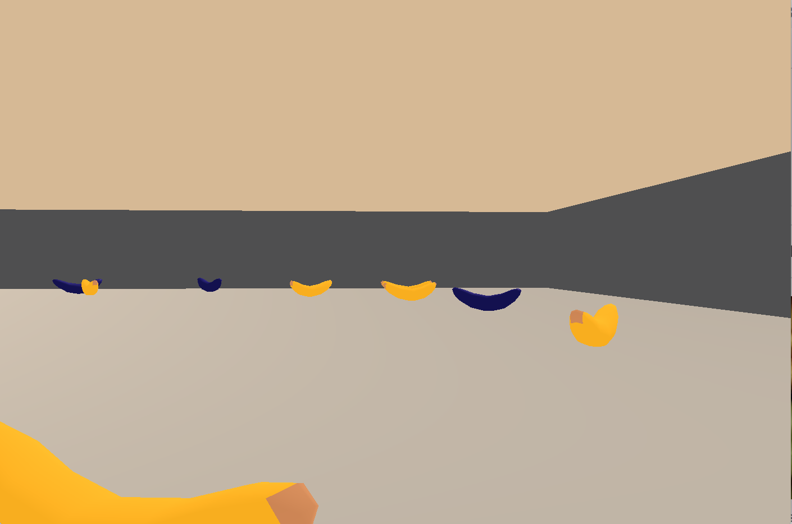

# Intro

This project looks at implementing the Deep Q Network (DQN) algorithm in order to solve a relatively simple navigation environment. 
This implementation used the Lunar Lander exercises as a foundation and was adapted to suite the Banana environment. As well as this, 
the following additional features were added:

* Double Learning
* Duelling Network
* Prioritized Experience Replay

This report will outline the experiments, techniques and results of implementing these various methods of DQN to solve the Banana environment.

# The environment

The environment used for this project was built using the Unity [ml-agents](https://github.com/Unity-Technologies/ml-agents) framework.
The environment itself is quite simple. The goal is to collect as many good objects as possible (yellow bananas) while avoiding dangerous objects(blue bananas).
The agent recieves a positive reward of +1 for each good banana collected and a negative reward -1 for each blue banana it hits.

The agent is given 37 state features to identify what is going on in the world around it. These are made up of 37 features that contain the velocity of the agent and 
sensor data recieved from the raycasts shooting from the agent and returning the information about what the ray is hit such as distance and color of the object hit. 
This works in a simular way to Lidar on a self driving car.

The agent can decide to move in 1 of 4 directions for each time steps:
* North 
* South
* East
* West

# Deep Q Learning Bot
DQN introduces a lot of changes to the traditional Q learning algorithm and isn't just replacing the Q table with a neural network.
As described in Deep Minds groundbreaking paper [Playing Atari with Deep Reinforcement Learning](https://arxiv.org/pdf/1312.5602.pdf) there are 
several advancements that make this algorithm work. Below I will go through the core techniques used to successfully implement the DQN algorithm.

## Models

Like I mentioned previously, one of the big changes in how we approach Q learning is the introduction of using a neural network to replace the Q table. Instead of storing every Q value in a look up table corresponding to its state and action, we can use the neural network to approximate the Q value of any state/action pair. This allows us to tackle infinitely more complex tasks that were out of reach for the simple tabular approach.

## Memory

## Agent

# Training

# Double Learning

# Duelling Network

# Prioritized Experience Replay

# Results

# Future Work
